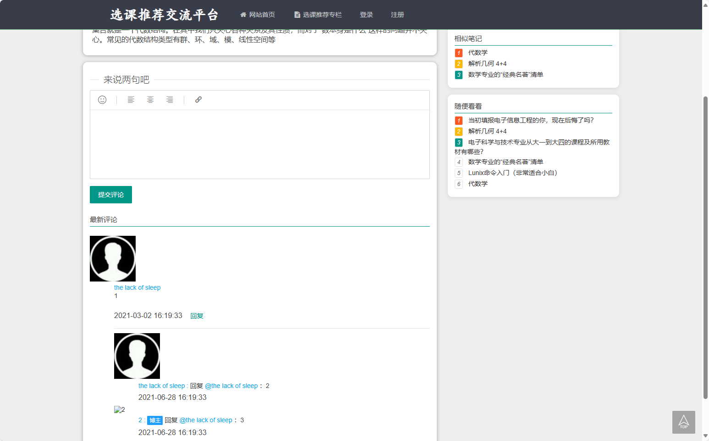
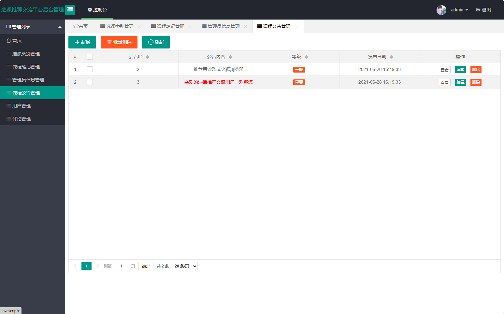

# 选课推荐交流平台(文末免费领取☟)
> 
#### 介绍
选课推荐交流平台(Java_SpringBoot)
有BUG可留言加微

#### 软件架构
Java + SpringBoot + jpa + thymeleaf + Mysql

#### 项目功能说明

> + 登录注册
> + 首页数据信息统计
> + 选课类别管理
> + 课程笔记管理
> + 管理员信息管理
> + 课程公告管理
> + 用户管理
> + 评论管理
> +  选课推荐专栏
> +  基本信息

### 部分功能演示

### 环境需求(可免费提供)
- idea/eclipse、jdk-1.8、maven-3.8.6、mysql、node.js等

## 有项目修改、安装调试需求 请联系以下

## 获取资源扫☝☝☝

